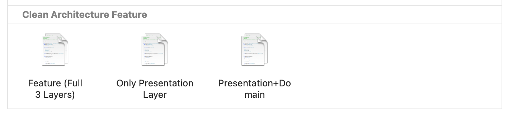
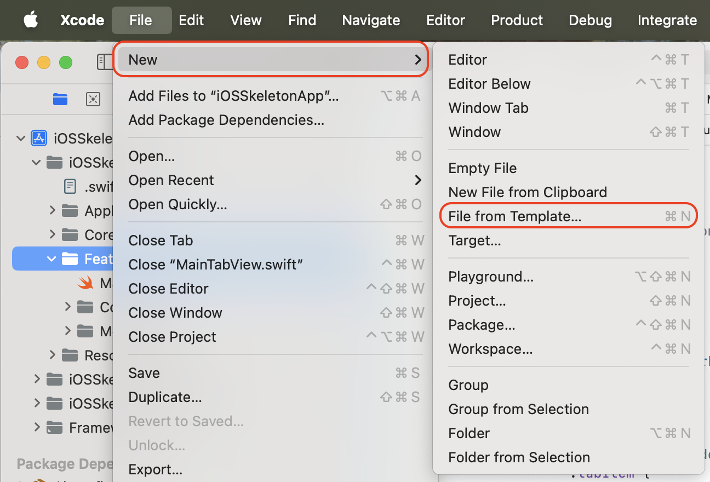
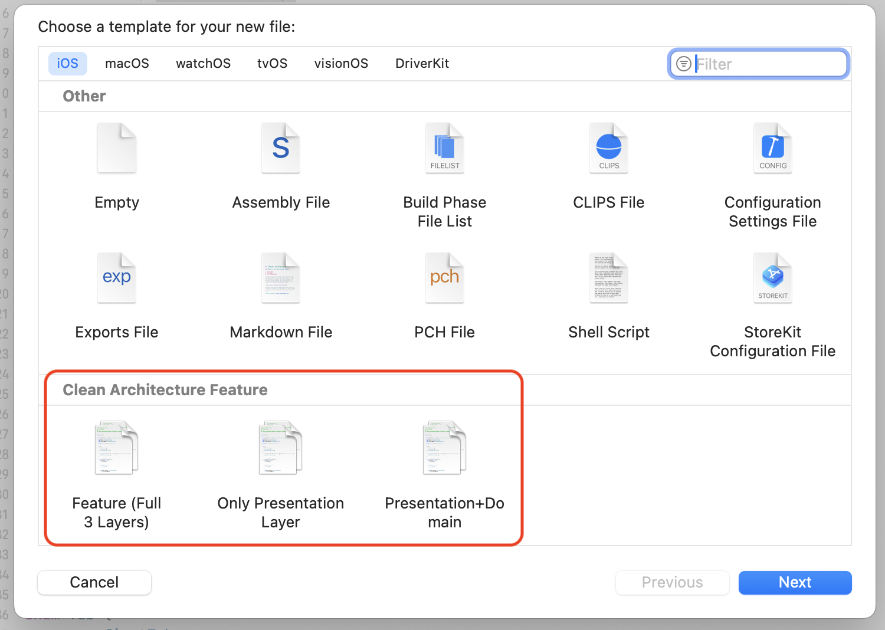
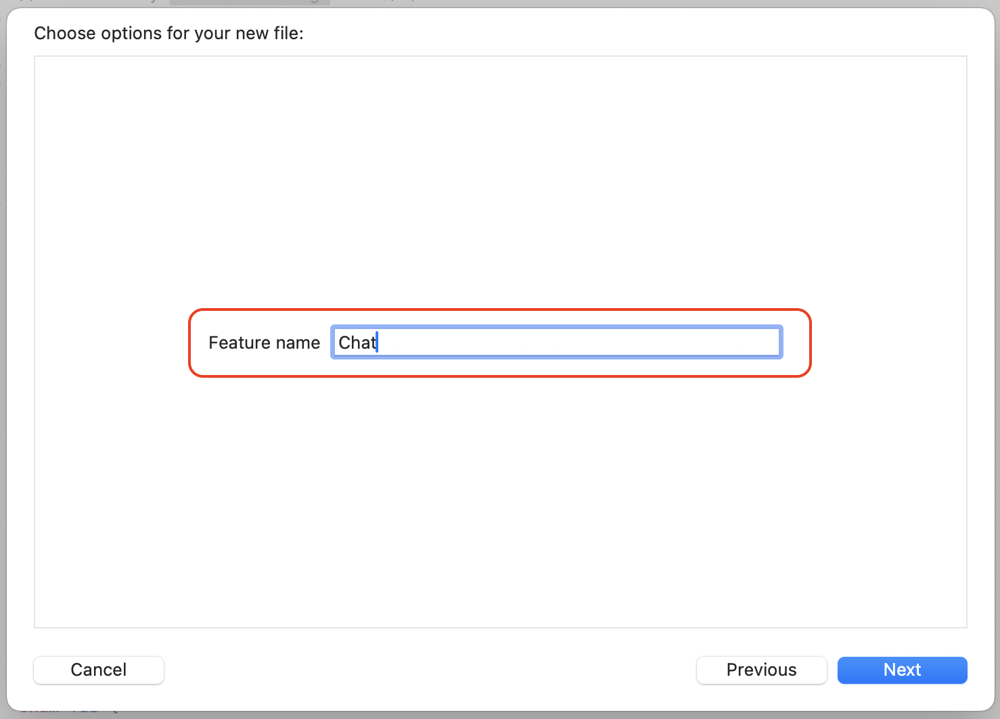
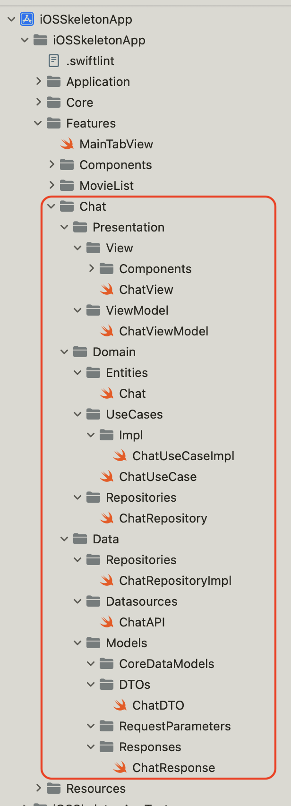

# CleanArchXcodeFileTemplate

An Xcode template designed for building robust, scalable new features with Clean Architecture.
Designed for seamless integration with the [iOSSkeletonApp](https://github.com/anhngoit/iOSSkeletonApp) project, but easily adaptable to any modern modular iOS codebase.

---

## 🚀 Features

* Rapidly create new features using Clean Architecture best practices
* Consistent folder and file structure (Presentation, Domain, Data layers)
* Plug-and-play with [iOSSkeletonApp](https://github.com/anhngoit/iOSSkeletonApp) or your own project

---

## 🛠 Installation

Open Terminal and `cd` into the **CleanArchXcodeFileTemplate** directory.

### Install the Xcode templates:

```sh
make install_templates
```

### Uninstall the templates:

```sh
make uninstall_templates
```

---

## ✨ Creating a New Feature with the Template

1. In Xcode, select
   **File → New → File...**
   

2. Choose your custom **Clean Architecture Feature** template from the list
    
       
3. Enter your feature/module name when prompted
    

4. Select a location for the generated files

5. Click **Create**—your new feature structure will be generated automatically!
    
---

## 🔌 After Generating a Feature

The generated files compile on their own, but three steps wire them into
[iOSSkeletonApp](https://github.com/anhngoit/iOSSkeletonApp):

1. **Register the dependencies.** Add the API data source, repository and use
   case to `Container` in `Core/DI/DIContainer.swift`:

   ```swift
   var <featureName>Repository: Factory<<FeatureName>Repository> {
       Factory(self) { <FeatureName>RepositoryImpl() }
           .cached
   }
   ```

   Then resolve them with `@Injected(\.<featureName>Repository)` in the `…Impl`
   and view model files.

2. **Generate the mocks.** The `…Repository` and `…UseCase` protocols are
   annotated with `// sourcery: AutoMockable`. Run the generator so the test
   target gets `…RepositoryMock` / `…UseCaseMock`:

   ```sh
   sourcery --config Tools/Sourcery/Sourcery.yml
   ```

   The output (`iOSSkeletonAppTests/Mocks/Generated/GeneratedMocks.swift`) is
   committed to git — generation is a manual step, not a build phase.

3. **Add the tests.** Create `<Feature>ViewModelTests`, `<Feature>UseCaseTests`
   and `<Feature>RepositoryTests` under `iOSSkeletonAppTests/Features/<Feature>/`,
   using Quick/Nimble and `Container.shared.<dependency>.register { mock }`.
   `MovieList` is the worked example.

---

## 💡 Tip
* Templates are installed in your `~/Library/Developer/Xcode/Templates` directory.
* Pair this template with [iOSSkeletonApp](https://github.com/anhngoit/iOSSkeletonApp) for a full-featured, scalable iOS architecture out of the box.

---

Enjoy rapid, maintainable, and scalable feature creation in your iOS projects!

---


---

**Author:** NGO QUANG TUAN ANH (Steven)

---

Let me know if you want an “Advanced Usage” or “Troubleshooting” section as well!
